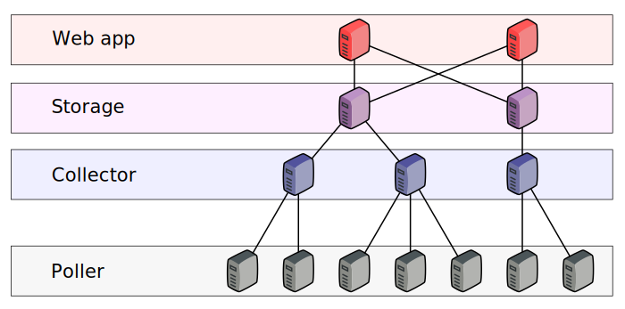
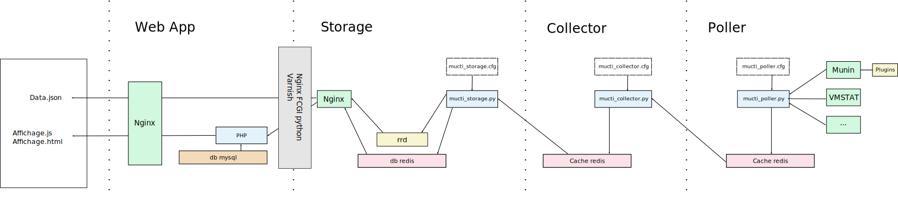

.. XXX: reference/datamodel and this have quite a few overlaps!

.. _overview:

############
Overview
############

***********
Components
***********

Actual Numeter architecture :

*********
Features
*********

  * Autoconfigure display with plugin datas
  * Get datas from external sources like munin
  * Keep data if network fail between poller and collector

************************
Functional architecture
************************

Functional architecture :

