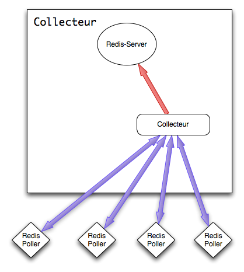

.. XXX: reference/datamodel and this have quite a few overlaps!

.. _overview:

############
Overview
############

.. image:: img/numeter_banner.png
    :align: center
    :width: 300px

Infrastructure Numeter : le but est de pouvoir ajouter chaque êlement X fois selon le besoin.

Chaque élément peut être installé sur la même machine ou des machines différentes suivant leurs caractéristiques.
Par exemple le Storage a besoin d'IO alors que le collector de RAM. 

Numeter est écrit en Python et utilise redis. Nous faisons actuellement le choix pour passer d'un poller mode pull en mode push avec par exemple rabbitmq.

***********
Components
***********

Actual Numeter architecture :

.. image:: img/architecture.svg
    :width: 720px
    :height: 370px

**Poller :** Agent installé sur les machines à grapher. Il se charge de la collecte des données et les garde en cache dans redis et permet une récupération de façon asynchrone.
Cela permet de ne pas perdre de valeurs en cas de coupure réseau entre le poller et le collector.

.. image:: img/poller.png

**Collector :** Récoltent les données des poller toute les 5 min par exemple et stock les résultats dans une base redis le temps qu'un storage les récupére.

**Storage :** Récoltent les données des collecteurs et les stock dans des base RRD. Le storage offre aussi une API web pour consulter les valeurs données.

.. image:: img/storage.png

**Webapp :** La webapp est en php et fonctionne avec dygraphs

    * http://dygraphs.com/

.. image:: img/webapp.png

*********
Features
*********

  * Autoconfigure display with plugin datas
  * Get datas from external sources like munin
  * Keep data if network fail between poller and collector
  * Graphs export des graphs en PNG, ...
  * Gestion des utilisateurs et groupes
  * Auto création de dashboard
  * Implémentation de features facilement (architecture ouverte)
  * Scalable 

************************
Functional architecture
************************

Functional architecture :

.. image:: img/fonctional_architecture.svg
    :width: 100%
    :height: 380px

***********
Screenshot
***********

.. image:: img/screenshot/memory_graph.png
