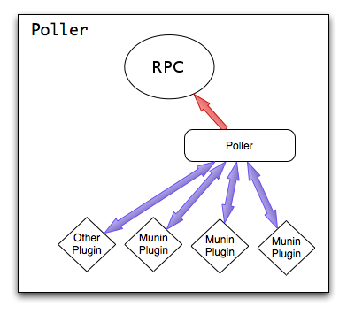
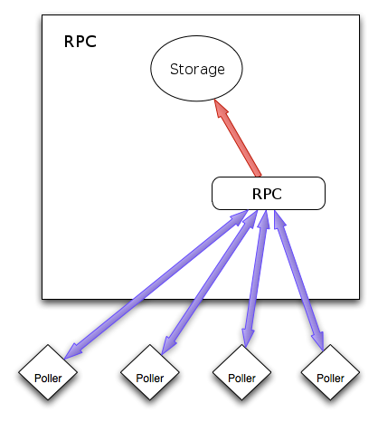
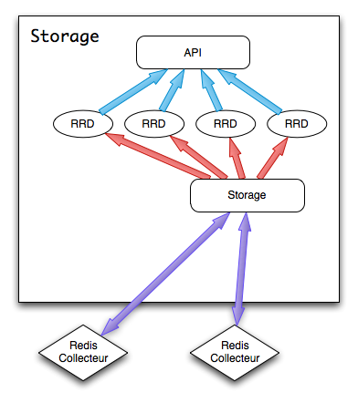
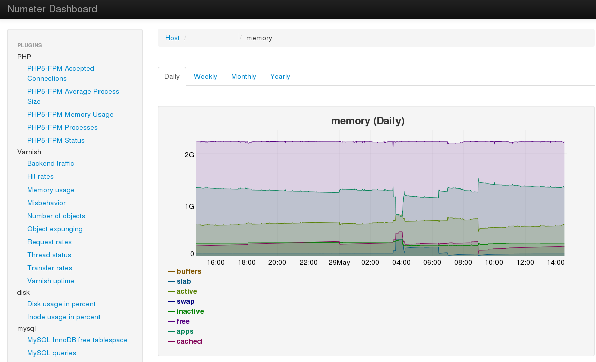
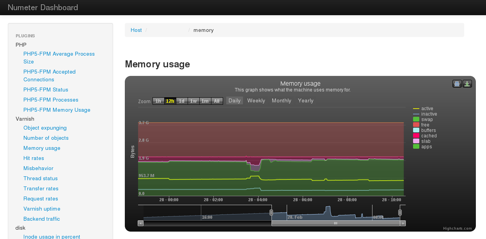

.. XXX: reference/datamodel and this have quite a few overlaps!

.. _overview:

############
Overview
############

.. image:: img/numeter_banner.png
    :align: center
    :width: 300px

The Numeter infrastructure : instances of every component may be added to handle the load

All components can be installed on the same server or on multiple servers depending on their specifications.

Numeter is written in Python and uses Redis. We are considering going from a pull mode to a push mode using rabbitmq.

***********
Components
***********

Current Numeter architecture :

.. image:: img/architecture.svg
    :width: 720px
    :height: 370px

**Poller :** An agent installed on the servers for which graphs are desired. It gathers data and send them to an rpc. In case of network failure all datas are preserved and sent when network is back.

**Rpc :** Receive data from poller and provide them to storage.

**Storage :** Data is fetched from the rpc and then stored in WSP files. An HTTP API allows access to the data.

**Webapp :** A Django webapp displays data using the js library like dygraphs

    * http://dygraphs.com/

*********
Features
*********

  * Autoconfigure display with plugin datas
  * Get data from external sources like munin
  * No data loss in case of network failure
  * PNG graph export
  * User & Group management
  * Automatic dashboard creation
  * Open architecture allows new features to be created easily
  * Scalable

************************
Functional architecture
************************

Functional architecture :

.. image:: img/fonctional_architecture.svg
    :width: 100%
    :height: 380px

***********
Screenshot
***********

